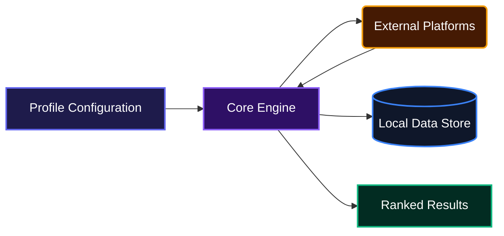
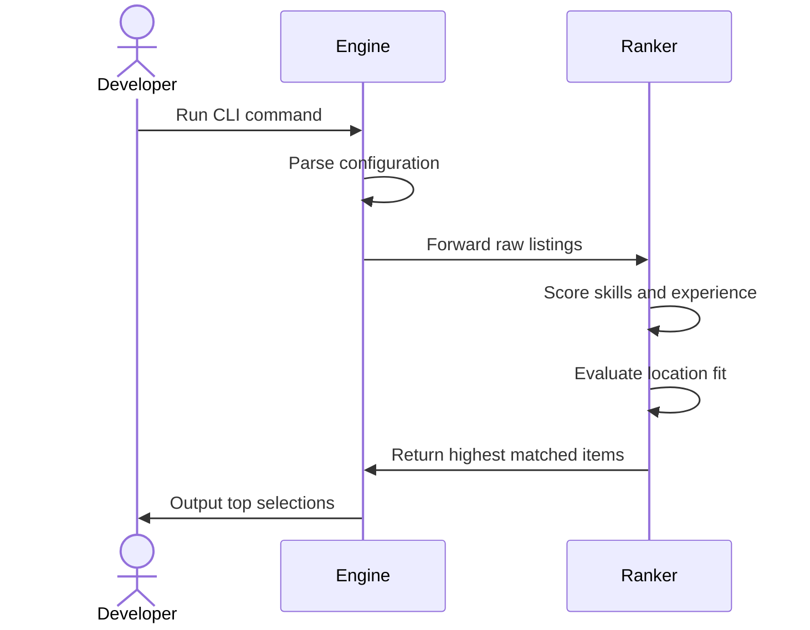
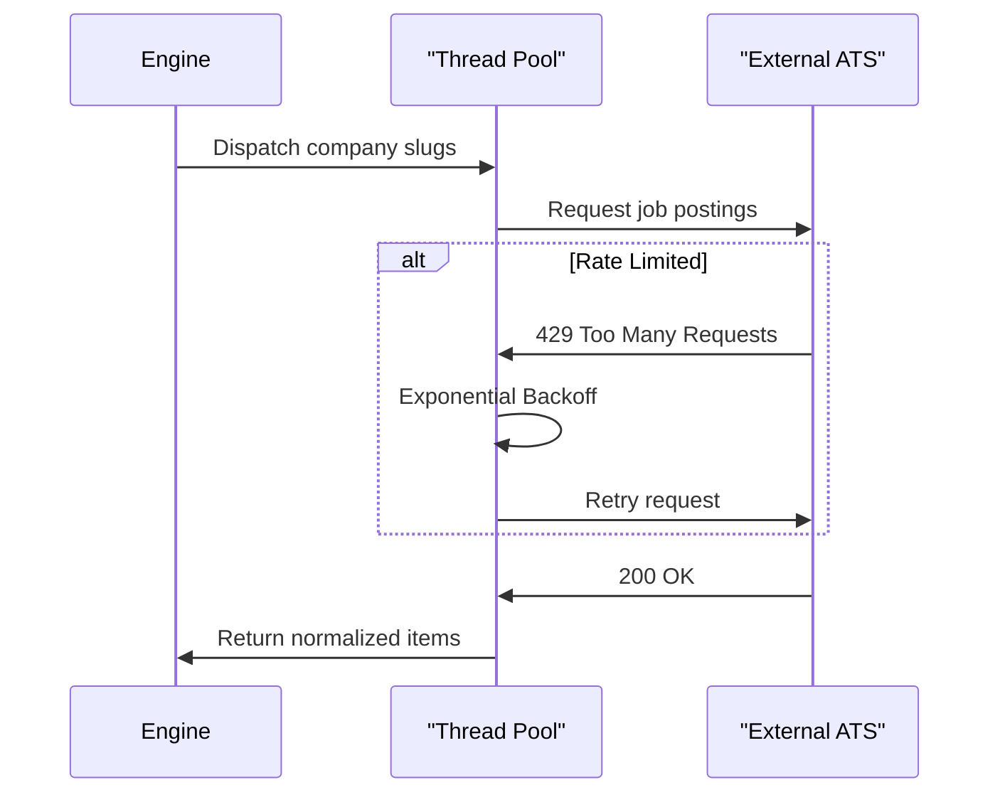

# Midnight

Midnight helps developers find highly relevant job postings and hackathons tailored to their specific career profiles. It reads a simple configuration file, gathers opportunities from major platforms, and ranks them based on relevance, tech stack, and location. This keeps daily opportunity hunting focused and efficient without the noise.

## System Architecture



## Installation

To set up the project locally, run the following commands:

```bash
git clone https://github.com/BuiltByElly/Midnight.git
cd Midnight
pip install uv
uv build
pip install -e .
```

## Usage

Configure the user profile by editing the `profile.yaml` file in the `src` directory. This file dictates what technologies, experience levels, and locations the engine looks for. 

Configure your profile with these details:

```yaml
user:
  name: "Elliot"
  email: "otoijaghaelliot@gmail.com"
  years_of_experience: 3

  location:
    country: "Nigeria"
    state: "Edo"
    city: "Benin"
    remote: true

  tech_stack:
    - "Python"
    - "TypeScript"
    - "React"

  interests:
   - "Software Development"
   - "AI/ML"

opportunities:
  - "jobs"
  - "hackathons"

schedule:
  send_time: "00:00"
  timezone: "Africa/Lagos"
```

Once configured, run the CLI tool from your terminal:

```bash
midnight
```

The system will start fetching, parsing, and ranking opportunities. Output will display directly in your console as JSON data containing the top matches.

## Features

*   **Profile-Based Ranking**
    The engine reads user preferences and calculates a match score for each opportunity. It rewards exact tech stack matches, remote availability, and appropriate seniority tiers while penalizing irrelevant postings.



*   **Concurrent Platform Fetching**
    Midnight connects to multiple applicant tracking systems concurrently. It includes smart throttling, User-Agent rotation, and exponential backoff to handle rate limits naturally.



*   **Smart Geolocation Parsing**
    Translates raw location strings into structured data. It handles remote keywords, timezone hints, and complex city-state mappings to ensure location preferences are matched accurately.
*   **Deduplication Memory**
    Maintains a local JSON ledger of seen URLs. This ensures developers do not waste time reviewing the same listings across multiple runs.

## Technologies Used

| Technology | Purpose |
| :--- | :--- |
| **Python 3.14** | Core programming language |
| **Pydantic** | Profile configuration parsing and validation |
| **HTTPX** | Async network requests |
| **BeautifulSoup4** | HTML parsing and description extraction |
| **PyYAML** | Configuration management |

## Author Info

*   GitHub: [BuiltByElly](https://github.com/BuiltByElly)

## Badges

[](https://www.python.org/)
[](https://docs.pydantic.dev/)

[](https://dokugen.samueltuoyo.com)